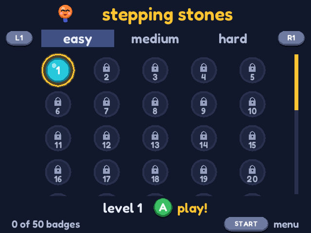
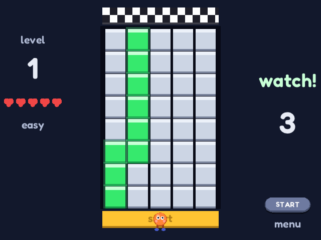
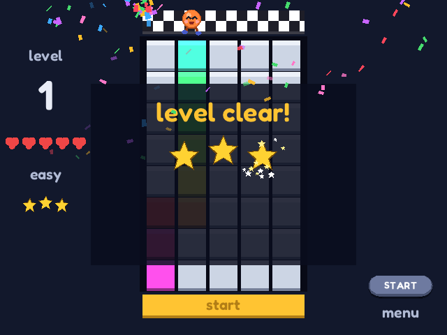

# Stepping Stones

**Watch the safe path light up, then walk it from memory.** One wrong step and the tile breaks!

A memory game for kids (and grown-ups), inspired by a famous YouTube tile-pattern challenge.
Made for Anbernic-style Linux handhelds (via [PortMaster](https://portmaster.games)), and it
also runs in a web browser as a single HTML file.

**▶ Play in your browser: https://stepping-stones-67o.pages.dev**
(or download [`docs/index.html`](docs/index.html) and open it - it's the whole game in one file)

| Home: badges & levels | Watch the path | Level clear! |
|--|--|--|
|  |  |  |

## How to play

- A safe path crosses the floor. It lights up green, tile by tile - remember it!
- Then it hides. Walk it with the d-pad (or arrow keys).
- Step on a wrong tile and it breaks: you lose a heart and start again from the bottom.
- Reach the finish to clear the level. No falls = 3 stars. Every level you clear wins a badge
  and unlocks the next one.

**150 levels:** 50 each on easy, medium and hard.

- **Easy** (the default) is made for young kids: a 5-tile-wide floor, short paths, lots of time
  to look, 5 hearts, and the path is shown again after a fall.
- **Medium** and **hard** use an 8-wide floor with longer, twistier paths, less time and fewer
  hearts. Later levels add paths that step backwards.

Big text everywhere, and every button is shown as a picture, so even kids who can't read yet
know what to press.

## Controls

| Action | Handheld | Keyboard (web) | Mouse / touch (web) |
|--|--|--|--|
| Walk / move | D-pad | Arrow keys | on-screen arrows |
| Play / next / choose | A | `A` or Space | on-screen **A** |
| Back | B | `B` or Backspace | on-screen **B** |
| Easy / medium / hard | L1 / R1 | `L` / `R` | on-screen **L** / **R** |
| Menu | Start | Enter or Esc | on-screen **Enter** / START |
| Quit | Select + Start | - | - |

## Install on a handheld

**PortMaster:** grab `steppingstones.zip` from the releases (or build it, below) and unzip it
into your ports folder (`roms/ports`, or `/storage/roms/ports` on ROCKNIX), then refresh the
games list. You get `Stepping Stones.sh` and a `steppingstones/` folder; progress is saved in
that folder.

Tested on: ROCKNIX on an Anbernic RG35XX Plus (640×480). Other firmwares and screens:
testing welcome!

## Build

Plain C11 with SDL2 (no other libraries; the font is drawn with stb_truetype).

```sh
make stones        # desktop build to try it out (needs SDL2: brew install sdl2 / apt install libsdl2-dev)
make portmaster    # aarch64 PortMaster package -> dist/steppingstones.zip
                   #   (set CROSS_CC to your aarch64 compiler; put the target's libSDL2.so in device-libs/)
make web           # one-file web version -> docs/index.html (needs Emscripten)
```

The web page is hosted on Cloudflare Pages as a static site: just `docs/index.html` plus
`web/_headers` (strict security headers: nothing loads from other sites, no camera/mic/location).

Test aid: `./stones --headless --seed 5 --script "-:20 A:250 P:9 P:9" --shots 10,260 --out DIR`
runs without a window and saves screenshots (`P` takes the next step along the real path).

### Code tour

| File | What's in it |
|--|--|
| `src/game.c` | rules, the hidden path (a random depth-first search), difficulty table, drawing, saves |
| `src/home.c` | the badge board / level select |
| `src/fx.c` | confetti, sparkles, the walking buddy, button pictures |
| `src/audio.c` | every sound and the music, synthesized at startup (no sound files) |
| `src/draw.c` | text (stb_truetype) and shapes |
| `src/menu.c`, `src/main.c` | menu; window, input and the 30 Hz game loop (desktop, handheld and browser) |
| `web/shell.html` | the web page around the game |
| `portmaster/` | PortMaster launcher, port.json, gameinfo.xml |

## License

The game's code is released under the [MIT License](LICENSE). The bundled font and library
keep their own licenses (see `licenses/`).

## Credits

- Game by Casey.
- Font: [Fredoka](https://fonts.google.com/specimen/Fredoka), SIL Open Font License (`licenses/`).
- [stb_truetype](https://github.com/nothings/stb) by Sean Barrett, public domain / MIT (`licenses/`).
- [SDL2](https://libsdl.org), zlib license.
